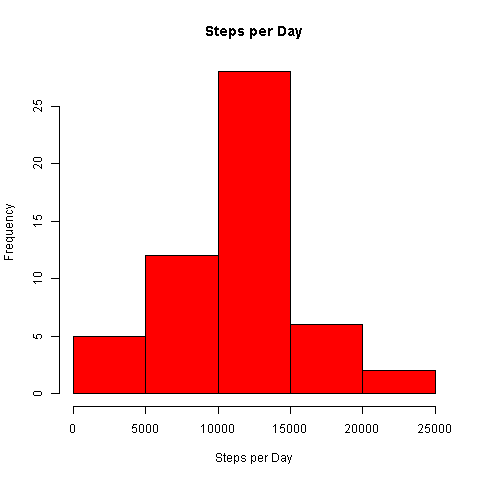
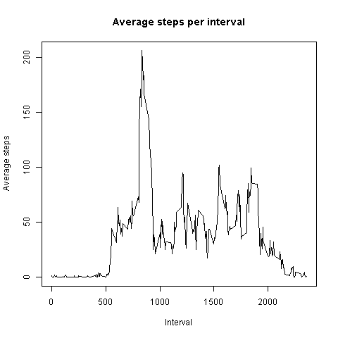
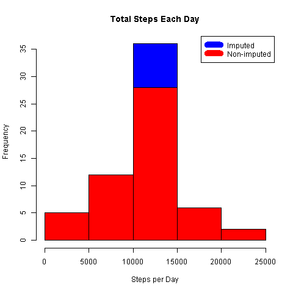
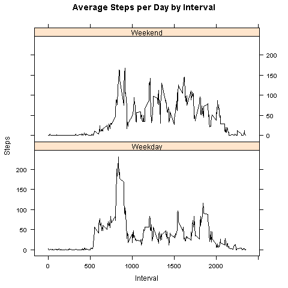

## Loading and preprocessing the data
Load the file into a temp file, unzip it, load it into the "data"" variable and define "date" column as a date
```{r}
temp <- tempfile()
download.file("http://d396qusza40orc.cloudfront.net/repdata%2Fdata%2Factivity.zip",temp)
unzip(temp)
unlink(temp)
data <- read.csv("activity.csv", header=TRUE, sep=",")
data$date <- as.Date(data$date, format="%Y-%m-%d")
```


## What is mean total number of steps taken per day?
Calculate number of steps per day (average and median used further)
```{r}
stepspday <- aggregate(data$steps, by=list(Date =data$date), FUN=sum)
meansteps <- mean(stepspday$x, na.rm=TRUE)
mediansteps <- median(stepspday$x, na.rm=TRUE)
```

The `Mean` number of steps is `r meansteps`.

The `Median` number of steps is `r mediansteps`.

###Histogram distribution
Creation of a Histogram showing the steps per day distribution
```{r}
png("plot1.png", width=480, height=480)
hist(stepspday$x,col="red",  breaks=7, main ="Steps per Day",xlab="Steps per Day")
invisible(dev.off())
```

 


## What is the average daily activity pattern?
Aggregation of data, creation of a simple graph and finding the most popular walking interval.
```{r}
steps_interval <- aggregate(steps ~ interval, data, mean)
png("plot2.png", width=480, height=480)
invisible(plot(steps_interval$interval,steps_interval$steps,type="l",main ="Average steps per interval",xlab="Interval", ylab="Average steps"))
invisible(dev.off())
## Max Interval
High_Interval <- steps_interval$interval[which(steps_interval$steps == max(steps_interval$steps))]
```

 

The most popular `Interval` is `r High_Interval`.


## Imputing missing values
Calculation of number of missing (NA) values and loop replacing NA values with the average found in this interval (filling blanks).
```{r}
data2<- na.omit(data)
nb_NA <- length(data$steps) - length(data2$steps)
data_corrected <- data
for (i in 1:length(data$steps)) {
  if(is.na(data$steps[i])){
    data_corrected$steps[i] <- as.integer(steps_interval[which(steps_interval$interval == data_corrected$interval[i]),][2])
  }
}
```
Calculation of new basic stats (mean, median)
```{r}
corrected_stepspday <- aggregate(data_corrected$steps, by=list(Date =data$date), FUN=sum)
corrected_meansteps <- mean(corrected_stepspday$x, na.rm=TRUE)
corrected_mediansteps <- median(corrected_stepspday$x, na.rm=TRUE)
corrected_steps_interval <- aggregate(data_corrected$steps, by=list(Interval =data_corrected$interval), FUN=mean, na.rm=TRUE)
```

Creation of a new plot showing differences between original and corrected data 

```{r}
png("plot3.png", width=480, height=480)
hist(corrected_stepspday$x,col="blue",  breaks=7, main = paste("Total Steps Each Day"),xlab="Steps per Day")
hist(stepspday$x,col="red",  breaks=7, main = paste("Total Steps Each Day"),xlab="Steps per Day",add=T)
legend("topright", c("Imputed", "Non-imputed"), col=c("blue", "red"), lwd=10)
invisible(dev.off())
```
 


Stats comparison
```{r}
diff_corrected = sum(data_corrected$steps) - sum(na.omit(data$steps))
newmeansteps <- mean(corrected_stepspday$x, na.rm=TRUE)
newmediansteps <- median(corrected_stepspday$x, na.rm=TRUE)

```
`Total Difference` between original and corrected data is equal to  `r diff_corrected`.

The `New Mean` number of steps is `r newmeansteps`.

The `New Median` number of steps is `r newmediansteps`.


## Are there differences in activity patterns between weekdays and weekends?
In order to define weekdays and weekends we first need to tell the program which days are weekdays (my system is in french, so weekdays are here in french)
```{r}
weekdays <- c("lundi", "mardi", "mercredi", "jeudi", "vendredi")
```

Another column (wd) is then added to the data_corrected variable, if the day is a weekday the value entered into this column will be "Weekday" else it will be "Weekend".

```{r}
data_corrected$wd <- as.factor(ifelse(is.element(weekdays(as.Date(data_corrected$date)),weekdays), "Weekday", "Weekend"))
```

Finally a new variable is created containing the average steps, their interval foreach day category.
```{r}
steps_interval2 <- aggregate(steps ~ interval + wd, data_corrected, mean)
```

A superposed graph is finally created (using lattice package) for both Weekdays and Weekend values.
```{r}
library(lattice)
png("plot4.png", width=480, height=480)
xyplot(steps_interval2$steps ~ steps_interval2$interval|steps_interval2$wd, main="Average Steps per Day by Interval",xlab="Interval", ylab="Steps",layout=c(1,2), col="black", type="l")
invisible(dev.off())
```
 
